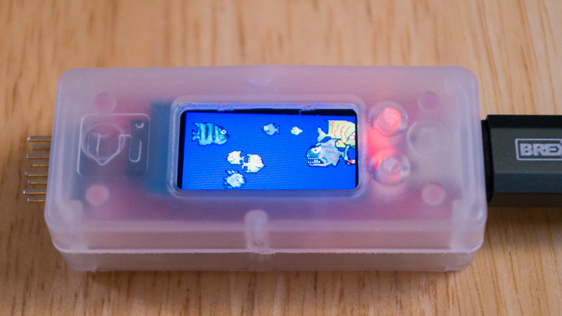

This is one of the first programs I have written in [Rust][1], so it
may be a little rough around the edges.

This is an embedded Rust program which runs on the [Longan Nano][16]
board, and displays an animated fish tank on the Longan Nano's.  The
Longan Nano is a [RISC-V][17] development board which only costs
$4.90, and comes with a tiny color LCD and a plastic case.

This program uses the [embedded-graphics][21] crate, so it should be
fairly easy to port to other microcontrollers and displays, as long as
the microcontroller is supported by Rust, and the display is supported
by embedded-graphics.

The Longan Nano is supported by the [longan-nano][18] crate, which I
previously tried out in [a blog post][22].

[][27]

[video][28]

## Instructions

[Install Rust][12] if you haven't already:

```
$ curl --proto '=https' --tlsv1.2 -sSf https://sh.rustup.rs | sh
$ source $HOME/.cargo/env
$ which rustc
/home/ppelleti/.cargo/bin/rustc
$ rustc --version
rustc 1.46.0 (04488afe3 2020-08-24)
```

Add support for RISC-V to Rust:

```
$ rustup target add riscv32imac-unknown-none-elf
```

Install a RISC-V toolchain.  On Ubuntu 20.04, I installed the
`gcc-riscv64-unknown-elf` package, which actually supports both 32-bit
and 64-bit RISC-V processors.

```
$ sudo apt-get install gcc-riscv64-unknown-elf
```

Install a version of [dfu-util][19] from May 2020 or later.  At the
time of this writing, that means installing from source:

```
$ cd ~/src
$ git clone git://git.code.sf.net/p/dfu-util/dfu-util
$ cd dfu-util
$ ./autogen.sh
$ ./configure
$ make
$ sudo make install
```

Now we can build the fish program.  Building with `--release` is
necessary, because the debug version of the program is too big to fit
in the Longan Nano's flash!

```
$ cd ~/src
$ git clone https://github.com/ppelleti/rs-embedded-fish
$ cd rs-embedded-fish
$ cargo build --release
```

If you installed a different RISC-V toolchain (such as a 32-bit only
one), your `objcopy` will probably have a different name than mine.

```
$ riscv64-unknown-elf-objcopy -O binary target/riscv32imac-unknown-none-elf/release/rs-embedded-fish fish.bin
```

Finally, while holding down the "BOOT" button, plug the Longan Nano
into a USB port on the computer.  Then upload the program:

```
$ sudo dfu-util -a 0 -s 0x08000000:leave -D fish.bin
```

The fish tank should start running automatically, as soon as
`dfu-util` is done.

## License

The code I have written is made available under the [Apache 2.0][23]
license.

The [fish images][24] were created by Ferenc Hechler for his
[AndroFish][25] Android game.  According to its F-droid page,
AndroFish is also licensed under the Apache 2.0 license.

I've copied a few lines of code from the examples in the
[longan-nano][18] crate, which is licensed under the
[ISC License][26].

[1]: https://www.rust-lang.org/
[12]: https://www.rust-lang.org/tools/install
[16]: https://www.seeedstudio.com/Sipeed-Longan-Nano-RISC-V-GD32VF103CBT6-Development-Board-p-4205.html
[17]: https://en.wikipedia.org/wiki/RISC-V
[18]: https://github.com/riscv-rust/longan-nano
[19]: http://dfu-util.sourceforge.net/
[21]: https://crates.io/crates/embedded-graphics
[22]: https://funwithsoftware.org/posts/2020-10-01-rust-on-longan-nano.html
[23]: https://www.apache.org/licenses/LICENSE-2.0
[24]: https://sourceforge.net/p/feri/svn/HEAD/tree/trunk/AndFish/res/drawable-mdpi/
[25]: https://f-droid.org/en/packages/de.hechler.andfish/
[26]: https://github.com/riscv-rust/longan-nano#license
[27]: https://www.flickr.com/photos/107479024@N04/50420943588/in/album-72157716259990378/
[28]: https://www.flickr.com/photos/107479024@N04/50420946023/in/album-72157716259990378/
